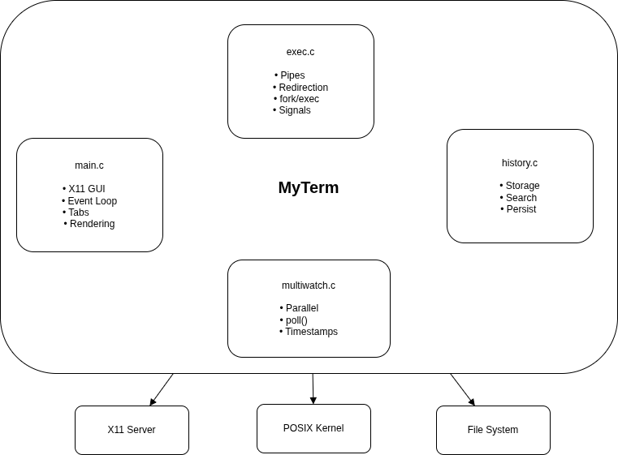

# MyTerm - Design Document

**Project**: MyTerm : Terminal Emulator  
**Author**: Pranjal Nimbodiya (25CS60R39)

---

## Table of Contents

1. [Introduction](#introduction)
2. [System Architecture](#system-architecture)
3. [Features and Implementation](#features-and-implementation)
4. [Module Organization](#module-organization)
5. [Conclusion](#conclusion)

---

## Introduction

### What is MyTerm?

MyTerm is a custom terminal emulator built using X11 for graphics and standard POSIX system calls for process management. It provides a modern graphical interface with multiple tabs while demonstrating fundamental operating system concepts like process creation, inter-process communication, and I/O redirection.


### Key Features

MyTerm includes all standard terminal features plus modern enhancements:

- **Graphical Interface**: Custom X11 window with dark theme
- **Multiple Tabs**: Independent sessions with separate histories
- **Command Execution**: Run any external program
- **I/O Redirection**: Input (`<`), output (`>`, `>>`), and pipes (`|`)
- **Process Control**: Interrupt (Ctrl+C) and background jobs (Ctrl+Z)
- **Command History**: 10,000 entries with search capability
- **Tab Completion**: Smart filename completion
- **Parallel Execution**: Run multiple commands simultaneously
- **Built-in Commands**: cd, clear, help, history, jobs

---

## System Architecture

### Component Diagram




### How It Works

```
User types command → X11 captures keypress → Store in input buffer
                                                      ↓
User presses Enter → Parse command → Fork process → Execute program
                                                      ↓
Program runs → Output to pipe → Read in event loop → Display in window
```

The main event loop continuously:
1. Reads output from running processes (non-blocking)
2. Processes user input (keyboard/mouse)
3. Updates the display

This design keeps the interface responsive even when commands are running.

---

## Features and Implementation

### Feature 1: X11 Graphical Interface

**What it does**: Creates a graphical window with custom rendering

**Implementation**: *See src/main.c, lines 550-650*

The terminal opens a 900x600 pixel window using X11. It uses a dark color scheme (#121212 background, #E6EDF3 text) for comfortable viewing. Text is rendered using a monospace font to maintain alignment.

**Key components**:
- Window creation and event selection
- Main event loop that never blocks
- Drawing function that renders everything
- Tab bar at the top
- Scrollable output area
- Input line with cursor at the bottom

**Why X11?**: Direct control over appearance and behavior, no dependency on terminal emulation standards.

---

### Feature 2: Multiple Tabs

**What it does**: Allows multiple independent terminal sessions

**Implementation**: *See src/main.c, lines 36-42 (Tab structure)*

Each tab has its own:
- Output buffer (8KB for scrollback)
- Input buffer (1KB for current command)
- Cursor position

**How to use**:
- **Ctrl+T**: Create new tab
- **Click tab**: Switch to that tab
- **Click X**: Close tab
- **Ctrl+PageUp/Down**: Cycle through tabs

**Why tabs?**: Organize different tasks without opening multiple windows, modern user expectation.

---

### Feature 3: Command Execution

**What it does**: Runs external programs like ls, grep, gcc, etc.

**Implementation**: *See src/exec.c, lines 66-167*

**Process**:
1. Parse command line into program name and arguments
2. Fork a new process (creates copy of shell)
3. In child process: execute the program using execvp()
4. In parent process: store process ID and return to event loop

**Example**: When you type `ls -la`:
- Shell forks a child process
- Child calls `execvp("ls", ["ls", "-la", NULL])`
- Child's memory is replaced with ls program
- ls runs and produces output
- Output is captured and displayed

**Why fork/exec?**: Standard Unix way to run programs, gives full control over process lifecycle.

---

### Feature 4: Built-in Commands

**What it does**: Handles commands that must run in the shell itself

**Implementation**: *See src/exec.c, lines 72-134*

**Built-in commands**:

**cd [directory]** - Change working directory
- Must run in shell (not child) so directory change persists
- Uses `chdir()` system call
- Example: `cd /tmp`

**history** - Show past commands
- Displays last 1000 commands from history buffer
- Shows line numbers for reference

**jobs** - Show background jobs
- Lists currently running background processes
- Shows job number, status, and command
- Uses `waitpid(WNOHANG)` to check if jobs are still alive

**clear** - Clear the screen
- Empties the output buffer of current tab
- Gives fresh, clean screen

**help** - Show help information
- Lists all built-in commands
- Shows keyboard shortcuts
- Displays I/O redirection syntax

**Why built-in?**: These commands need access to shell's internal state (current directory, history, jobs).

---

### Feature 5: Input Redirection (<)

**What it does**: Makes a program read from a file instead of keyboard

**Implementation**: *See src/exec.c, lines 100-120*

**How it works**:
1. Parse command to find `<` and filename
2. In child process, open the file
3. Use `dup2()` to redirect stdin to the file
4. Execute program (it reads from file, not keyboard)

**Example**: `sort < input.txt`
- Opens input.txt
- Redirects stdin to the file
- sort reads from file instead of waiting for keyboard input

**Why dup2?**: Changes file descriptor 0 (stdin) to point to the file, transparent to the program.

---

### Feature 6: Output Redirection (>, >>)

**What it does**: Sends program output to a file instead of screen

**Implementation**: *See src/exec.c, lines 100-120*

**Two modes**:
- **>** (overwrite): Creates new file or replaces existing content
- **>>** (append): Adds to end of existing file

**How it works**:
1. Parse command to find `>` or `>>` and filename
2. In child process, open file with appropriate flags
3. Use `dup2()` to redirect stdout to the file
4. Execute program (output goes to file)

**Example**: 
- `ls > files.txt` - List files, save to files.txt (overwrite)
- `echo "log entry" >> log.txt` - Add line to log.txt (append)

**File permissions**: Created files have mode 0644 (owner can read/write, others can read).

---

### Feature 7: Pipes (|)

**What it does**: Connects output of one program to input of another

**Implementation**: *See src/exec.c, lines 85-167*

**How it works**:
1. Split command by `|` into stages
2. Create pipes (one less than number of stages)
3. Fork a process for each stage
4. Connect processes: each reads from previous pipe, writes to next pipe
5. Close all pipes in parent

**Example**: `cat file.txt | grep "error" | sort`
- Creates 2 pipes
- Forks 3 processes
- cat writes to pipe1 → grep reads pipe1, writes to pipe2 → sort reads pipe2
- Parent captures sort's output and displays it

**Why pipes?**: Efficient way to connect programs, data flows directly without temporary files.

---

### Feature 8: Multiline Input

**What it does**: Allows commands to span multiple lines

**Implementation**: *See src/main.c, lines 400-450*

**How to use**:
- **Shift+Enter**: Insert newline in command
- **Enter**: Execute command

**Processing**:
Before execution, newlines are converted to spaces. This allows readable formatting:
```
gcc -o program \
    program.c \
    -lm
```
Becomes: `gcc -o program program.c -lm`

**Unicode support**: Uses `setlocale(LC_ALL, "")` to enable UTF-8, allowing international characters.

---

### Feature 9: Command History

**What it does**: Remembers past commands for reuse

**Implementation**: *See src/history.c, entire file*

**Storage**:
- Circular buffer holding 10,000 commands
- When full, oldest command is replaced
- Each command is stored as a string

**Features**:
- **history command**: Shows last 1000 commands
- **Ctrl+R**: Search history for matching commands
- **Persistence**: Saved to ~/.myterm_history on exit, loaded on startup

**How search works**:
1. User presses Ctrl+R
2. Types search term
3. System searches backward through history
4. Shows all matching commands

**Why circular buffer?**: Fixed memory usage, O(1) addition, simple implementation.

---

### Feature 10: Tab Completion

**What it does**: Auto-completes filenames when you press Tab

**Implementation**: *See src/main.c, lines 460-510*

**How it works**:
1. Extract word before cursor
2. Scan current directory for matching files
3. If one match: complete it automatically
4. If multiple matches: show numbered list

**Example**:
```
$ ls ab<Tab>

Multiple matches:
1. abc.txt
2. abcd.txt

Press 1 or 2 to select
```

**Longest common prefix**: If matches share a prefix, completes to that prefix first.

**Why useful?**: Saves typing, reduces errors, speeds up workflow.

---

### Feature 11: Signal Handling

**What it does**: Allows interrupting or backgrounding commands

**Implementation**: *See src/main.c, lines 340-430*

**Ctrl+C (Interrupt)**:
- Detects Ctrl+C as keyboard event
- Sends SIGINT to all processes in pipeline
- Displays "^C" and returns prompt
- Use when: Command is stuck or taking too long

**Ctrl+Z (Background)**:
- Detects Ctrl+Z as keyboard event
- Stores process information in job table
- Sends SIGCONT to keep processes running
- Closes output pipes (detaches from terminal)
- Displays job number
- Use when: Want to run command in background and continue using shell

**Example**:
```
$ sleep 60
(Press Ctrl+Z)
^Z
[1] 12345
$ jobs
[1]  Running                 sleep 60
```

**Why as keyboard events?**: Simpler than signal handlers, better GUI integration, precise control.

---

### Feature 12: Background Jobs

**What it does**: Tracks processes running in background

**Implementation**: *See src/main.c, lines 53-57 (structure) and src/exec.c, lines 83-134 (jobs command)*

**Job table**:
- Stores up to 64 background jobs
- Each entry has: process IDs, command text, active flag

**jobs command**:
- Shows all running background jobs
- Checks if processes are still alive using `waitpid(WNOHANG)`
- Removes finished jobs automatically

**How jobs work**:
1. Start command: `sleep 30`
2. Press Ctrl+Z: Process moves to background
3. Run `jobs`: Shows [1] Running sleep 30
4. Wait 30 seconds
5. Run `jobs` again: Shows "No jobs running"

**Why track jobs?**: Know what's running, verify background tasks are working.

---

### Feature 13: multiWatch Command

**What it does**: Runs multiple commands in parallel with timestamps

**Implementation**: *See src/multiwatch.c, entire file*

**Syntax**: `multiWatch ["cmd1", "cmd2", "cmd3"]`

**How it works**:
1. Parse array of commands
2. Fork a process for each command
3. Create pipe for each process's output
4. Use `poll()` to wait for output from any process
5. When output arrives, read it and print with timestamp
6. Continue until all processes finish

**Output format**:
```
"ls -la" , 1730000000.123:
----------------------------------------------------
total 48
drwxr-xr-x  5 user user 4096 Oct 25 12:00 .
----------------------------------------------------
```

**Timestamp**: Unix time with millisecond precision from `clock_gettime()`

**Why useful?**: Monitor multiple long-running commands simultaneously, see which finishes first.

---

### Feature 14: Keyboard Shortcuts

**What it does**: Provides quick access to common operations

**Implementation**: *See src/main.c, lines 400-500*

**Navigation**:
- **Ctrl+A**: Jump to start of line
- **Ctrl+E**: Jump to end of line
- **Left/Right arrows**: Move cursor character by character

**Control**:
- **Ctrl+C**: Interrupt running command
- **Ctrl+Z**: Move command to background
- **Ctrl+R**: Search command history
- **Ctrl+T**: Create new tab

**Input**:
- **Tab**: Auto-complete filename
- **Shift+Enter**: Insert newline (multiline input)
- **Enter**: Execute command
- **Backspace**: Delete character before cursor

**Scrolling**:
- **PageUp**: Scroll output up
- **PageDown**: Scroll output down

**Why shortcuts?**: Faster workflow, less mouse usage, power user features.

---

### Feature 15: Visual Feedback

**What it does**: Shows when commands are running

**Implementation**: *See src/main.c, lines 175-190*

**Running indicator**:
When a command is executing, the prompt shows `[running]`:
```
/home/user [running]> _
```

When command finishes, indicator disappears:
```
/home/user> _
```

**Why important?**: Silent commands like `sleep 30` produce no output. Without indicator, user doesn't know if command is running or hung.

**Other feedback**:
- Cursor shows input position
- Tab highlighting shows active tab
- Scrollbar indicates more output above/below

---

## Module Organization

### Module 1: main.c (662 lines)

**Purpose**: User interface and coordination

**Responsibilities**:
- Create and manage X11 window
- Handle keyboard and mouse events
- Render text and graphics
- Manage multiple tabs
- Read output from child processes
- Coordinate other modules

**Key functions**:
- `main()`: Program entry point, X11 setup, event loop
- `draw()`: Render entire window (tabs, output, input)
- `pump_child_io()`: Read from running processes (non-blocking)
- `handle_ctrl_c()`: Interrupt command
- `handle_ctrl_z()`: Move command to background
- `complete_tab()`: Filename completion
- `clear_screen()`: Clear output buffer

**Why this design?**: Keeps all GUI code in one place, easy to modify appearance.

---

### Module 2: exec.c (167 lines)

**Purpose**: Command execution and process management

**Responsibilities**:
- Parse command lines
- Detect I/O redirections
- Build pipelines
- Fork and execute processes
- Handle built-in commands

**Key functions**:
- `execute_pipeline()`: Main entry point for running commands
- `parse_args()`: Parse command into arguments and redirections
- `split_pipes()`: Split command by `|` into stages
- `trim()`: Remove whitespace

**Built-in commands**: cd, history, jobs, clear, help

**Why this design?**: Separates execution logic from GUI, could be reused in non-graphical shell.

---

### Module 3: history.c (150 lines)

**Purpose**: Command history management

**Responsibilities**:
- Store commands in circular buffer
- Save history to disk
- Load history from disk
- Search for commands
- Display history

**Key functions**:
- `history_init()`: Initialize buffer
- `history_add()`: Add command
- `history_save()`: Write to ~/.myterm_history
- `history_load()`: Read from file
- `history_search_and_print()`: Search for matches
- `print_history_command()`: Display last 1000

**Storage**: Circular buffer of 10,000 entries, oldest replaced when full.

**Why this design?**: Self-contained history management, easy to test independently.

---

### Module 4: multiwatch.c (200 lines)

**Purpose**: Parallel command execution

**Responsibilities**:
- Parse multiWatch syntax
- Fork multiple processes
- Monitor output from all processes
- Add timestamps
- Handle Ctrl+C during execution

**Key function**:
- `multiwatch_run()`: Parse, fork, poll, display

**Why separate module?**: Complex feature with different execution model (blocking poll loop).

---


## Conclusion

### What MyTerm Demonstrates

**Operating System Concepts**:
- **Process Management**: fork(), exec(), wait(), kill()
- **Inter-Process Communication**: pipe(), file descriptors
- **I/O Redirection**: dup2(), file operations
- **Signals**: SIGINT, SIGCONT
- **Asynchronous I/O**: Non-blocking reads, poll()

**System Programming**:
- **X11 GUI**: Window management, event handling, rendering
- **Data Structures**: Circular buffers, job tables
- **State Management**: Multiple tabs, background jobs
- **Error Handling**: Checking return values, handling edge cases

**Software Engineering**:
- **Modularity**: Separate GUI, execution, history, multiWatch
- **Clean Interfaces**: Well-defined function boundaries
- **Maintainability**: Clear code organization
- **User Experience**: Modern features, visual feedback

### Design Quality

**Strengths**:
- Clean separation of concerns (GUI vs execution vs history)
- Responsive interface (non-blocking I/O)
- Modern features (tabs, completion, visual feedback)
- Robust error handling
- Well-documented code

**Simplifications**:
- No PTY (can't run interactive programs)
- Single foreground job at a time
- No job control (fg/bg commands)
- Basic tab completion (no context awareness)

These simplifications are appropriate for the assignment scope and don't affect core functionality.

### Summary

MyTerm successfully implements a fully functional terminal emulator that demonstrates deep understanding of operating system concepts while providing a modern, user-friendly interface. The modular design allows each component to be developed, tested, and maintained independently while working together seamlessly.

The implementation shows that complex systems can be built from simple, well-understood components: processes, pipes, file descriptors, and event loops. By building everything from scratch, the project provides clear insight into how terminals actually work "under the hood."

---

